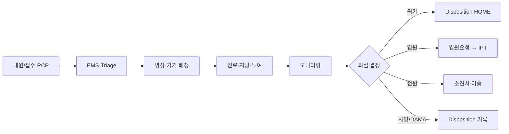
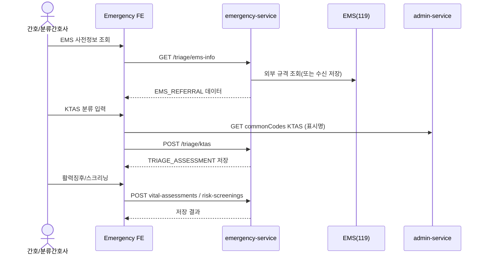
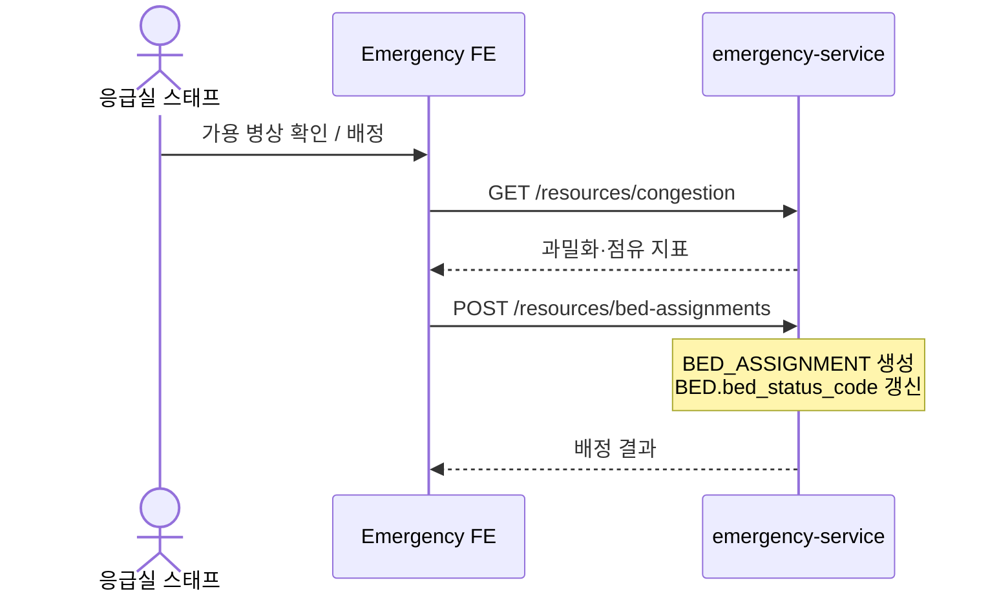
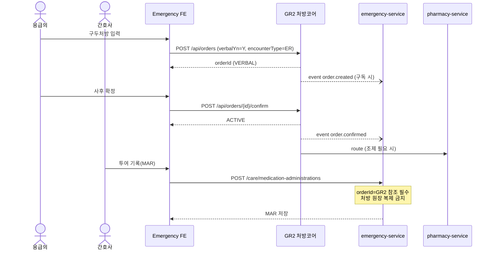
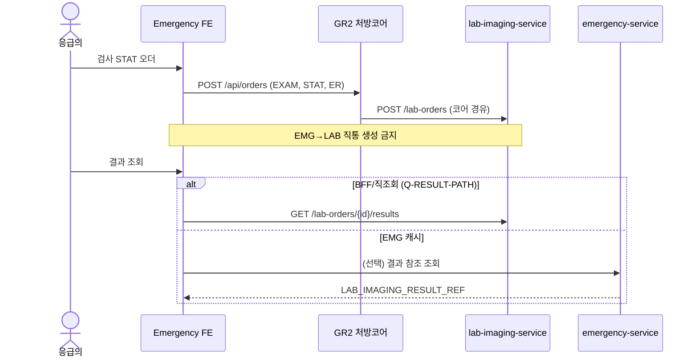
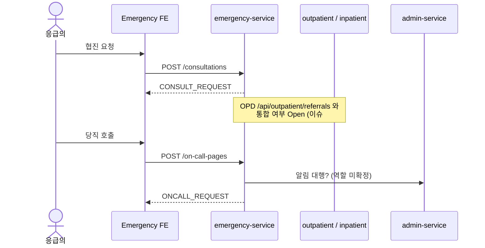
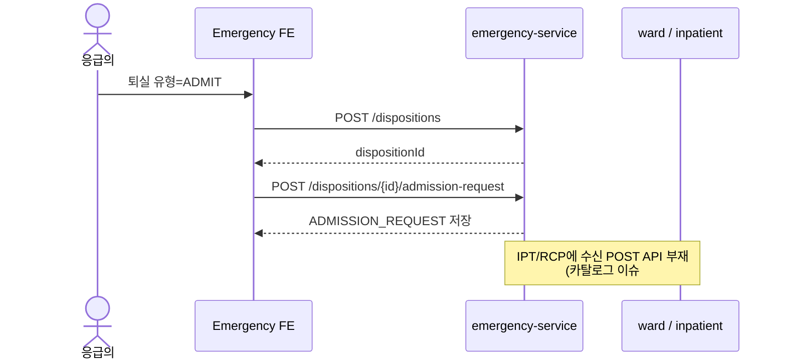
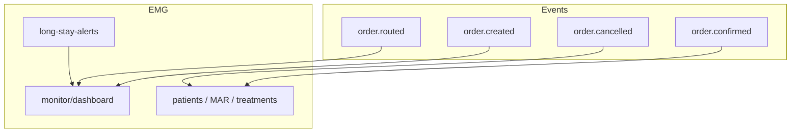

# 업무 흐름 및 시퀀스

근거: UML 유스케이스, API 목록, MSA 경계

## 1. 전체 환자 여정



---

## 2. 상태평가 (Triage) 시퀀스



격리 등록 시 DUR 이력은 EMG가 쓰지 않고 GR2/PHM을 **조회(Consumer)** 합니다.

---

## 3. 병상 배정



---

## 4. 구두처방 → 확정 → MAR (핵심)

처방 SoT는 GR2, 투여 기록은 EMG입니다.



**트레이드오프:** 처방·투여를 서비스로 분리하면 일관성 검증(투여 가능 상태)이 분산됩니다. 대신 이중기입·채널별 처방 원장 난립을 막을 수 있습니다. 확정 전 MAR은 정책으로 차단하는 것이 안전합니다.

---

## 5. 검사 STAT 오더 → 결과 조회



---

## 6. 협진 / 당직 (채널 ≠ 처방)



---

## 7. 퇴실 → 입원 요청



전원 시에는 `transfer-note` 작성 전 GR2 `GET /api/orders`로 투약내역을 조회해 소견서에 반영합니다(스냅샷이 아닌 조회 시점 데이터).

---

## 8. 현황판·이벤트 동기화



---

## 9. 프론트 상태 흐름 (Saga)

```text
Component ──dispatch──► Slice(*Request)
                            │
                         Saga (axios)
                            │
              ┌─────────────┼─────────────┐
              ▼             ▼             ▼
         EMG API      GR2 /api/orders   PAT/LAB/ADM
              │             │             │
              └──── *Success / *Failure ──┘
                            │
                      Selector → UI
```

컴포넌트에서 axios 직접 호출은 금지합니다 (`개발표준가이드` 10·11장).

---

## 10. 구현 시 주의 (안티패턴)

| 안티패턴 | 올바른 방향 |
| --- | --- |
| EMG DB에 처방 원장 테이블 재도입 | GR2만 SoT, `order_id` 참조 |
| LAB/PHM 오더 POST를 EMG에서 직통 | GR2 생성 + 코어 라우팅 |
| 환자명·약명을 컬럼에 복제 | 식별자 + API/배치 조회 |
| 알레르기를 EMG에 POST | PAT safety-info만 |
| 협진을 `/orders` 하위 API로 구현 | `/consultations` 분리 |
| 동의 PDF를 EMG에 저장 | Admin 양식 + 동의여부만 |
