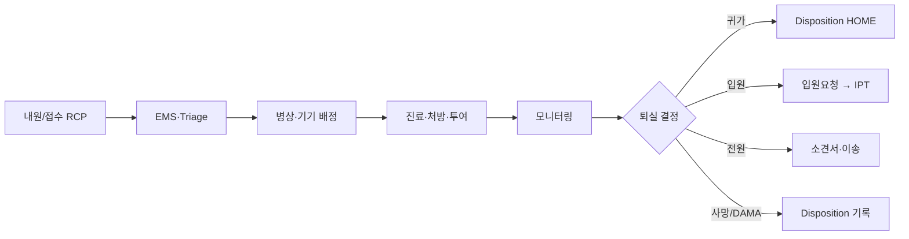
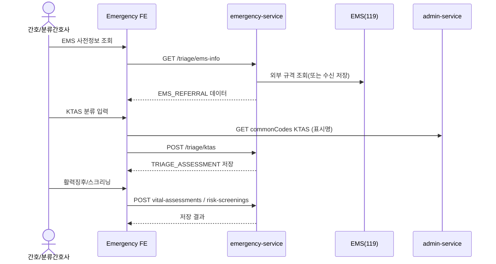
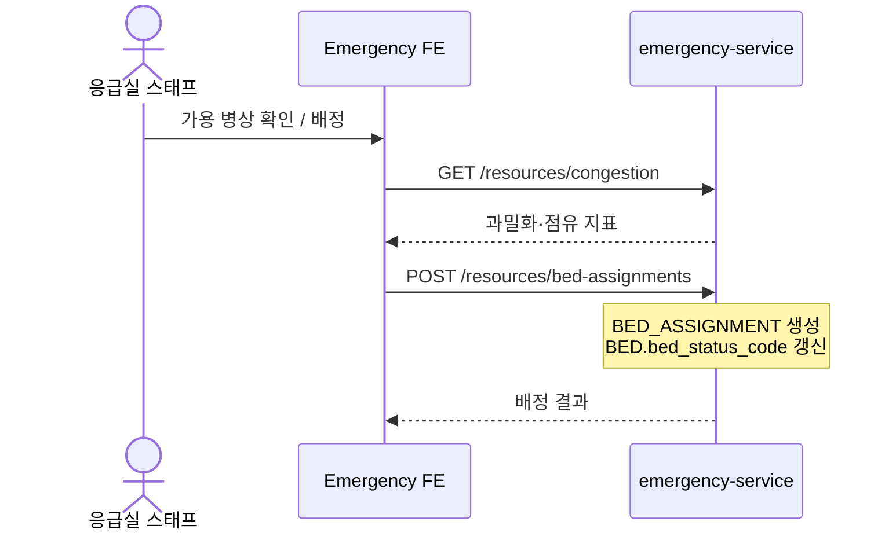
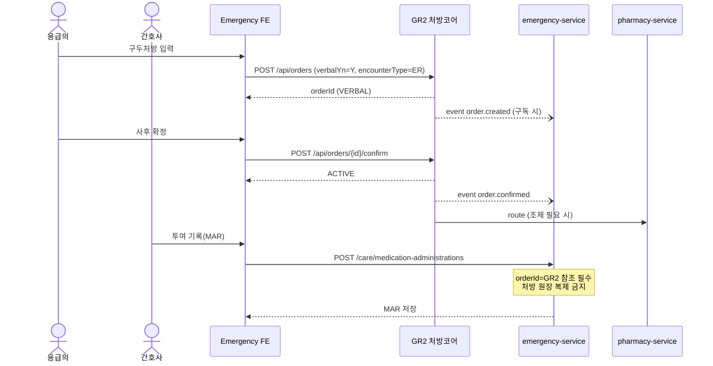
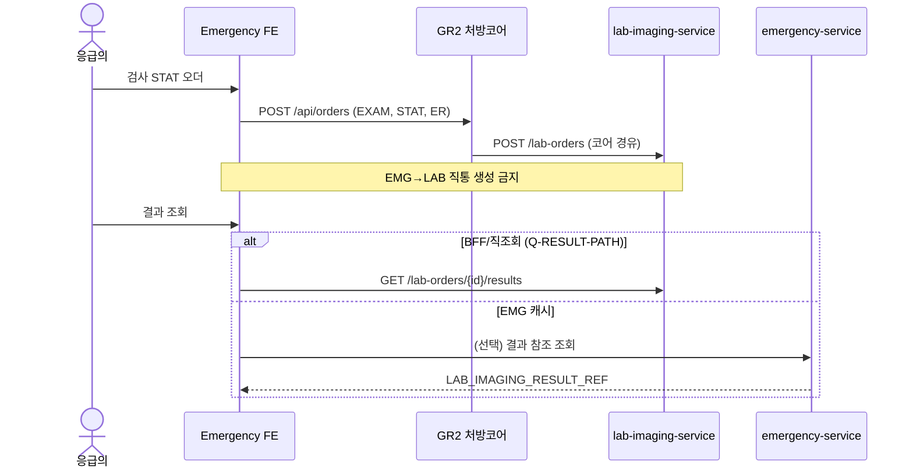
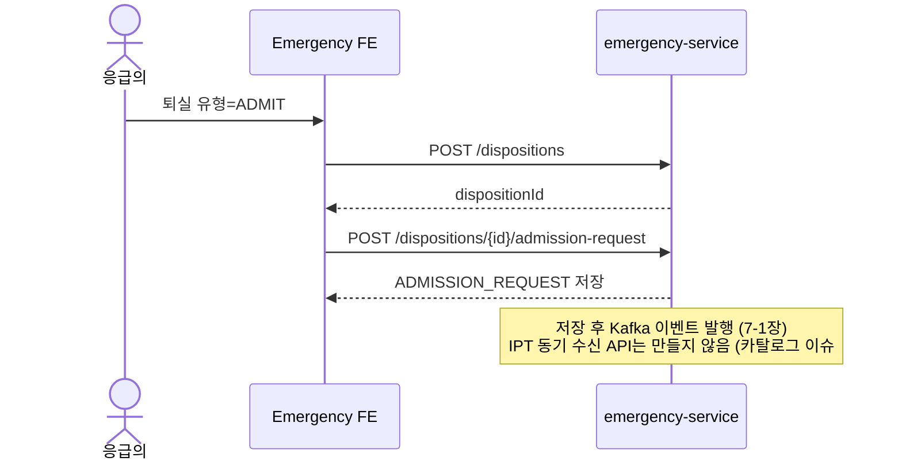
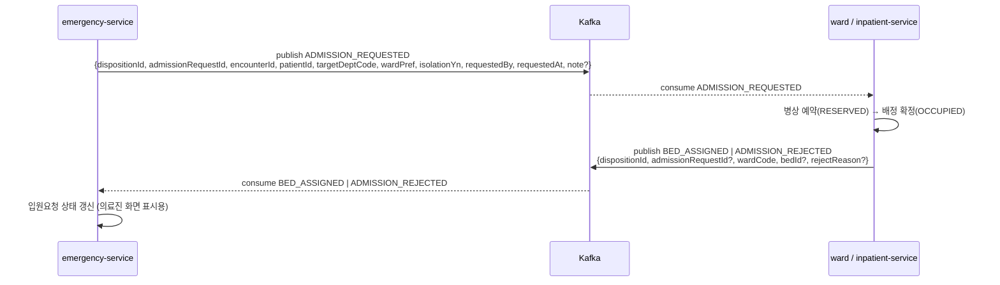
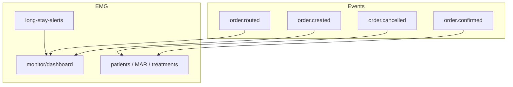

# 업무 흐름 및 시퀀스

근거: UML 유스케이스, API 목록, MSA 경계

## 1. 전체 환자 여정


```mermaid
flowchart LR
  A[내원/접수 RCP] --> B[EMS·Triage]
  B --> C[병상·기기 배정]
  C --> D[진료·처방·투여]
  D --> E[모니터링]
  E --> F{퇴실 결정}
  F -->|귀가| G[Disposition HOME]
  F -->|입원| H[입원요청 → IPT]
  F -->|전원| I[소견서·이송]
  F -->|사망/DAMA| J[Disposition 기록]
```

---

## 2. 상태평가 (Triage) 시퀀스


```mermaid
sequenceDiagram
  actor Nurse as 간호/분류간호사
  participant FE as Emergency FE
  participant EMG as emergency-service
  participant EMS as EMS(119)
  participant ADM as admin-service

  Nurse->>FE: EMS 사전정보 조회
  FE->>EMG: GET /triage/ems-info
  EMG->>EMS: 외부 규격 조회(또는 수신 저장)
  EMG-->>FE: EMS_REFERRAL 데이터

  Nurse->>FE: KTAS 분류 입력
  FE->>ADM: GET commonCodes KTAS (표시명)
  FE->>EMG: POST /triage/ktas
  EMG-->>FE: TRIAGE_ASSESSMENT 저장

  Nurse->>FE: 활력징후/스크리닝
  FE->>EMG: POST vital-assessments / risk-screenings
  EMG-->>FE: 저장 결과
```

격리 등록 시 DUR 이력은 EMG가 쓰지 않고 GR2/PHM을 **조회(Consumer)** 합니다.

---

## 3. 병상 배정


```mermaid
sequenceDiagram
  actor Staff as 응급실 스태프
  participant FE as Emergency FE
  participant EMG as emergency-service

  Staff->>FE: 가용 병상 확인 / 배정
  FE->>EMG: GET /resources/congestion
  EMG-->>FE: 과밀화·점유 지표
  FE->>EMG: POST /resources/bed-assignments
  Note over EMG: BED_ASSIGNMENT 생성<br/>BED.bed_status_code 갱신
  EMG-->>FE: 배정 결과
```

---

## 4. 구두처방 → 확정 → MAR (핵심)

처방 SoT는 GR2, 투여 기록은 EMG입니다.


```mermaid
sequenceDiagram
  actor MD as 응급의
  actor RN as 간호사
  participant FE as Emergency FE
  participant GR2 as GR2 처방코어
  participant EMG as emergency-service
  participant PHM as pharmacy-service

  MD->>FE: 구두처방 입력
  FE->>GR2: POST /api/orders (verbalYn=Y, encounterType=ER)
  GR2-->>FE: orderId (VERBAL)
  GR2--)EMG: event order.created (구독 시)

  MD->>FE: 사후 확정
  FE->>GR2: POST /api/orders/{id}/confirm
  GR2-->>FE: ACTIVE
  GR2--)EMG: event order.confirmed
  GR2->>PHM: route (조제 필요 시)

  RN->>FE: 투여 기록(MAR)
  FE->>EMG: POST /care/medication-administrations
  Note over EMG: orderId=GR2 참조 필수<br/>처방 원장 복제 금지
  EMG-->>FE: MAR 저장
```

**트레이드오프:** 처방·투여를 서비스로 분리하면 일관성 검증(투여 가능 상태)이 분산됩니다. 대신 이중기입·채널별 처방 원장 난립을 막을 수 있습니다. 확정 전 MAR은 정책으로 차단하는 것이 안전합니다.

---

## 5. 검사 STAT 오더 → 결과 조회


```mermaid
sequenceDiagram
  actor MD as 응급의
  participant FE as Emergency FE
  participant GR2 as GR2 처방코어
  participant LAB as lab-imaging-service
  participant EMG as emergency-service

  MD->>FE: 검사 STAT 오더
  FE->>GR2: POST /api/orders (EXAM, STAT, ER)
  GR2->>LAB: POST /lab-orders (코어 경유)
  Note over FE,LAB: EMG→LAB 직통 생성 금지

  MD->>FE: 결과 조회
  alt BFF/직조회 (Q-RESULT-PATH)
    FE->>LAB: GET /lab-orders/{id}/results
  else EMG 캐시
    FE->>EMG: (선택) 결과 참조 조회
    EMG-->>FE: LAB_IMAGING_RESULT_REF
  end
```

---

## 6. 협진 / 당직 — 범위 제외

협진 요청·당직의 호출은 프로젝트 기간 단축으로 **범위에서 제외**했다(2026-09-30, UML `01-5 최종`). `/consultations`, `/on-call-pages` API와 `CONSULT_REQUEST`·`ONCALL_REQUEST` 코드는 삭제했다. (번호는 유지)

---

## 7. 퇴실 → 입원 요청


```mermaid
sequenceDiagram
  actor MD as 응급의
  participant FE as Emergency FE
  participant EMG as emergency-service

  MD->>FE: 퇴실 유형=ADMIT
  FE->>EMG: POST /dispositions
  EMG-->>FE: dispositionId

  FE->>EMG: POST /dispositions/{id}/admission-request
  EMG-->>FE: ADMISSION_REQUEST 저장
  Note over EMG: 저장 후 Kafka 이벤트 발행 (7-1장)<br/>IPT 동기 수신 API는 만들지 않음 (카탈로그 이슈#6 해결)
```

전원 시에는 `transfer-note` 작성 전 GR2 `GET /api/orders`로 투약내역을 조회해 소견서에 반영합니다(스냅샷이 아닌 조회 시점 데이터).

---

## 7-1. 입원요청 이벤트 (Kafka, 응급 → 병동 직접)

> **결정 (2026-09-30)**: 응급이 병동(IPT)으로 **직접** 입원요청 이벤트를 보낸다. 원무(RCP) 경유 단계(`REGISTRATION_COMPLETED`)는 두지 않는다. 별도 오케스트레이터 서비스도 없다.
> **구현**: 병동팀과 토픽 이름·메시지 규격 합의 후 착수.


```mermaid
sequenceDiagram
  participant EMG as emergency-service
  participant Kafka as Kafka
  participant IPT as ward / inpatient-service

  EMG->>Kafka: publish ADMISSION_REQUESTED<br/>{dispositionId, admissionRequestId, encounterId, patientId, targetDeptCode, wardPref, isolationYn, requestedBy, requestedAt, note?}
  Kafka-->>IPT: consume ADMISSION_REQUESTED
  IPT->>IPT: 병상 예약(RESERVED) → 배정 확정(OCCUPIED)
  IPT->>Kafka: publish BED_ASSIGNED | ADMISSION_REJECTED<br/>{dispositionId, admissionRequestId?, wardCode, bedId?, rejectReason?}
  Kafka-->>EMG: consume BED_ASSIGNED | ADMISSION_REJECTED
  EMG->>EMG: 입원요청 상태 갱신 (의료진 화면 표시용)
```

- 입원요청 상태(`ADMISSION_REQUEST.request_status_code`, admin 그룹 `ADMISSION_REQUEST_STATUS_CD`): 01 요청됨 → 02 병상 배정 완료 | 03 거부.
- **구현(2026-09-30)**: 발행 `KafkaAdmissionEventPublisher`, 회신 구독 `AdmissionReplyKafkaListener` + `AdmissionReplyHandler`. 기본은 **꺼짐**(`app.kafka.admission.enabled=false` → 저장만 하고 로그). 병동팀과 규격 합의 뒤 `true` 로 켠다. 토픽은 설정으로 바꾼다: `app.kafka.admission.requested-topic`(기본 `emergency.admission.requested.v1`), `app.kafka.admission.bed-assigned-topic`(`inpatient.admission.bed-assigned.v1`), `app.kafka.admission.rejected-topic`(`inpatient.admission.rejected.v1`). 2026-09-30 병동팀과 공유 브로커로 요청·배정·거부 3개 시나리오 송수신 확인.
- **발행 시점**: 입원요청은 DB 커밋이 끝난 뒤 발행한다(롤백되면 발행 안 함). 커밋 전에 보내면 병동의 빠른 회신이 아직 저장 안 된 요청을 찾지 못해 유실될 수 있기 때문.
- **이번 범위(병동팀 합의 2026-09-30)**: 처음 배정 회신만 반영한다. 배정 후 병상 변경·배정 취소, 입원요청 취소 이벤트는 없다(필요하면 병동에서 수동 정리). 화면의 병동은 희망 병동(wardPref)이 아니라 BED_ASSIGNED 회신의 `wardCode`(`ADMISSION_REQUEST.ASSIGNED_WARD_CODE`, 컬럼 추가 스크립트 `scripts/alter-admission-request-add-ward.sql`)로 보여준다.
- **재요청**: 거부된 뒤 다시 요청해도 `dispositionId`는 같다. 대신 요청마다 새 `admissionRequestId`를 메시지에 실어 보내고, 병동이 회신에 그대로 돌려주면 그 요청에 정확히 반영한다(없으면 가장 최근 요청). 이미 배정/거부된 요청은 뒤늦은 회신으로 덮어쓰지 않는다.
- **서버가 꺼져 있는 동안**: Kafka가 메시지를 보관하므로, 병동 서버가 꺼진 사이의 요청은 병동이 켜질 때, 응급 서버가 꺼진 사이의 회신은 응급이 켜질 때(컨슈머 그룹 `emergency-service-admission`이 마지막으로 읽은 위치부터) 처리된다.
- `dispositionId`가 요청·응답을 잇는 키다. 병동은 응답에 반드시 그대로 돌려줘야 한다.
- `patientId`·`isolationYn`은 응급이 발행 시점에 접수(RECEPTION_INTAKE)·격리평가에서 조회해 채운다. 응급에는 진단 데이터가 없어 `diagnosis`는 뺐다(병동이 필요하면 협의).
- 병상 **가용 여부 조회**(`GET`, IPT)는 이 이벤트 흐름과 별개로 계속 **동기 REST 유지** — 쓰기 없음, 참고용 사전 체크.
- 응급이 병동 자원에 직접 쓰기(배정)하는 경로는 없음 — 병상 예약·배정 쓰기는 IPT 소유.
- 응급은 병동의 API 주소를 몰라도 됨 — 토픽 이름과 메시지 스펙만 계약(contract)으로 관리.
- 응급에게 최종 결과(`BED_ASSIGNED`/`ADMISSION_REJECTED`) 회신은 필요 — 응급 의료진이 병동 수용 여부를 알아야 환자를 올려보낼 수 있다. 응답을 받으면 입원 환자는 퇴실 처리 완료(DONE)가 되고, **이때 응급실 병상은 자동으로 해제된다**(해제자 `SYSTEM`, 병상 EMPTY — 귀가·사망·자의퇴원은 결정 즉시, 전원은 소견서 작성 시점도 같다). 병동 병상은 병동 소유라 응급이 건드리지 않는다. 자동 해제 전에 수동으로 비우려면 `PATCH /resources/bed-assignments/{id}/release`, 현재 배정은 `GET /resources/bed-assignments/current?receptionId=`로 조회한다.

---

## 8. 현황판·이벤트 동기화


```mermaid
flowchart TB
  subgraph EMG
    DASH[monitor/dashboard]
    LOS[long-stay-alerts]
    CARE[patients / MAR / treatments]
  end
  subgraph Events
    E1[order.created]
    E2[order.confirmed]
    E3[order.cancelled]
    E4[order.routed]
  end
  E1 --> DASH
  E2 --> CARE
  E3 --> CARE
  E4 --> DASH
  LOS --> DASH
```

---

## 9. 프론트 상태 흐름 (Saga)

```text
Component ──dispatch──► Slice(*Request)
                            │
                         Saga (axios)
                            │
              ┌─────────────┼─────────────┐
              ▼             ▼             ▼
         EMG API      GR2 /api/orders   PAT/LAB/ADM
              │             │             │
              └──── *Success / *Failure ──┘
                            │
                      Selector → UI
```

컴포넌트에서 axios 직접 호출은 금지합니다 (`개발표준가이드` 10·11장).

---

## 10. 구현 시 주의 (안티패턴)

| 안티패턴 | 올바른 방향 |
| --- | --- |
| EMG DB에 처방 원장 테이블 재도입 | GR2만 SoT, `order_id` 참조 |
| LAB/PHM 오더 POST를 EMG에서 직통 | GR2 생성 + 코어 라우팅 |
| 환자명·약명을 컬럼에 복제 | 식별자 + API/배치 조회 |
| 알레르기를 EMG에 POST | PAT safety-info만 |
| 동의서 원본·서명을 EMG에 저장 | 종이 동의서 수령 사실만 `CONSENT_RECORD`에 기록 |
