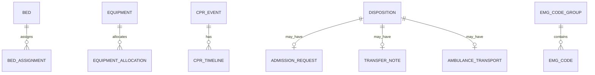

# 도메인 모델

근거: `ER_HIS_dbdiagram_oracle_1.dbml`, `ER_EMG_domain_code_oracle.dbml`, `개발표준가이드` 14장, `학습방식_변경_및_MSA_최소구현기준`(2026-07-22)  
DBMS: **Oracle** · 스키마: emergency-service 소유

## 1. 도메인 맵

```text
┌─────────────┐   reception_id(논리참조)   ┌──────────────┐
│ Reception   │◄──────────────────────────│   EMG BC     │
│ (RCP)       │                           │              │
└─────────────┘                           │  Triage      │
                                          │  Resource    │
┌─────────────┐   order_id(논리참조)       │  Care        │
│ GR2 Order   │◄──────────────────────────│  Channel     │
│ Core        │                           │  Monitor     │
└─────────────┘                           │  Disposition │
                                          │  Codes       │
┌─────────────┐   result/status 캐시       └──────────────┘
│ LAB / PHM   │◄── REF 테이블만
└─────────────┘
```

> `reception_id`, `order_id`, `*_by_id` 는 **물리 FK가 아닌 서비스 간 논리적 참조**입니다.

## 2. 엔티티 관계 개요



모든 업무 행은 `reception_id`(또는 API의 encounterId)로 응급 방문에 묶입니다.

## 3. 테이블 상세

### 3.1 상태평가

| 테이블 | 주요 컬럼 | 유스케이스 |
| --- | --- | --- |
| `EMS_REFERRAL` | ems_agency_name, vitals_on_scene, prehospital_treatment, transmitted_at | EMS 조회 |
| `TRIAGE_ASSESSMENT` | ktas_level_code, assessment_type_code, assessed_by_id, assessed_at, reason | KTAS 분류/재평가 |
| `EWS_RECORD` | systolic_bp, heart_rate, resp_rate, temperature, spo2, gcs, ews_score | 조기 상태평가 |
| `ISOLATION_ASSESSMENT` | isolation_type_code, required_yn, decided_at, released_at | 격리 |
| `RISK_SCREENING` | screening_type_code(SEPSIS/STROKE), score, result_code | 위험 스크리닝 |

### 3.2 자원관리

| 테이블 | 주요 컬럼 | 비고 |
| --- | --- | --- |
| `BED` | bed_no, zone_code, bed_type_code, bed_status_code | 마스터 |
| `BED_ASSIGNMENT` | bed_id, assigned_at, released_at | 배정 이력 |
| `EQUIPMENT` | asset_no, equipment_type_code, equipment_status_code | 마스터 |
| `EQUIPMENT_ALLOCATION` | equipment_id, allocated_at, returned_at | 할당 이력 |

혼잡도는 `BED`/`BED_ASSIGNMENT` 집계로 산출합니다.

### 3.3 응급진료

| 테이블 | 주요 컬럼 | 비고 |
| --- | --- | --- |
| `CLINICAL_NOTE` | content, recorded_by_id, recorded_at, signed_at | EMR |
| `TREATMENT_RECORD` | order_id(GR2), treatment_type_code, description, performed_at | 처치 |
| `MEDICATION_ADMINISTRATION` | order_id(**필수 정책**), order_item_id, drug_code, dose, route_code, administered_at | MAR |
| `CPR_EVENT` | started_at, ended_at, outcome_code | CPR 부모 |
| `CPR_TIMELINE` | cpr_event_id, event_at, event_type_code, detail | 타임라인 |

### 3.4 채널·참조 (처방 원장 아님)

| 테이블 | 역할 |
| --- | --- | --- |
| `LAB_IMAGING_RESULT_REF` | LAB 결과 링크/상태 캐시 (`result_ref`). 본문 SoT=LAB |
| `PHARMACY_STATUS_REF` | 조제 상태 캐시. 라우팅 SoT=GR2→PHM |
| `CONSULT_REQUEST` | 협진 채널 |
| `SURGERY_REQUEST` | 수술·시술 채널 (헤더는 GR2) |
| `ONCALL_REQUEST` | 당직 호출 |

**이관·제거됨 (GR2 소유):** `CLINICAL_ORDER`, `VERBAL_ORDER_CONFIRM`, `ORDER_CHANGE_LOG`, `MEDICATION_ORDER`

### 3.5 모니터링·퇴실

| 테이블 | 주요 컬럼 |
| --- | --- |
| `LOS_ALERT` | threshold_minutes, triggered_at, acknowledged_* |
| `DISPOSITION` | disposition_type_code, decided_by_id, decided_at |
| `ADMISSION_REQUEST` | disposition_id, target_dept_code, request_status_code |
| `TRANSFER_NOTE` | target_hospital_code, content, written_* |
| `AMBULANCE_TRANSPORT` | ambulance_no, transport_type_code, departed_at, arrived_at |

### 3.6 업무코드

| 테이블 | 컬럼 |
| --- | --- |
| `EMG_CODE_GROUP` | group_code(UK), group_name, description, use_yn, sort_order |
| `EMG_CODE` | emg_code_group_id, code_value, code_name, use_yn, sort_order |

Unique: `(group, code_value)`

## 4. EMG 소유 코드그룹 (시드)

| group_code | 예시 값 |
| --- | --- |
| CARE_STATUS | WAITING, IN_CARE, OBSERVATION, DISCHARGE_WAIT |
| ZONE | RESUS, CRITICAL, URGENT, FAST_TRACK, PEDIATRIC, ISOLATION |
| BED_TYPE | GENERAL, ICU_LIKE, ISOLATION, PEDIATRIC |
| BED_STATUS | EMPTY, OCCUPIED, CLEANING, OUT_OF_SERVICE |
| EQUIP_TYPE / EQUIP_STATUS | VENTILATOR… / AVAILABLE, IN_USE, MAINTENANCE |
| ASSESSMENT_TYPE | INITIAL, REASSESS |
| ISOLATION_TYPE | CONTACT, DROPLET, AIRBORNE, PROTECTIVE |
| SCREENING_TYPE / RESULT | SEPSIS, STROKE / NEGATIVE, POSITIVE, INCONCLUSIVE |
| ARRIVAL_PATH | EMS_119, WALK_IN, TRANSFER_IN, SELF_TRANSPORT |
| TREATMENT_TYPE | AIRWAY, IV, SUTURE, CAST… |
| CPR_EVENT_TYPE / CPR_OUTCOME | COMPRESSION, DEFIB… / ROSC, EXPIRED, TRANSFER |
| CONSULT_STATUS | REQUESTED, ACCEPTED, REPLIED, CANCELLED |
| DISPOSITION_TYPE | HOME, ADMIT, TRANSFER, DEATH, DAMA |
| TRANSPORT_TYPE | BLS, ALS |

**EMG 시드 금지 (타 소유)**

| 소유 | 코드 |
| --- | --- |
| ADM 공통 | KTAS_LEVEL, DEPT, DRUG, EXAM, DIAGNOSIS(KCD) |
| GR2 | ORDER_TYPE, ORDER_STATUS, PRIORITY, CHANGE_TYPE, VERBAL 상태 |

## 5. 식별자·네이밍 규칙

| 규칙 | 예시 |
| --- | --- |
| 테이블 | `UPPER_SNAKE_CASE` |
| 컬럼 | `lower_snake_case` |
| PK | `{table}_id` **VARCHAR2(36) UUID** (MSA 공통 통일) |
| 내부 FK | `{참조테이블}_id` VARCHAR2(36) — 동일 스키마 내 PK 참조 |
| 타 서비스 논리 참조 | 상대 SoT 타입 따름 (`reception_id`, GR2 `order_id` 등) |
| 업무번호(순수) | `*_no` VARCHAR2(20) — 타 서비스 PK 참조가 아닌 경우만 |
| `reception_id` | **VARCHAR2(36)** — RCP `RECEPTION_ID`(PK)를 참조하는 논리 FK. 이전에는 `reception_no`로 불렀으나, RCP 실제 PK 컬럼명과 일치시켜 혼동을 없애기 위해 `reception_id`로 통일(2026-09-03). PK/FK VARCHAR2(36) 통일 합의(2026-08-26)는 그대로 유지 |
| 코드 | `*_code` / `*_cd` |
| 여부 | `*_yn` CHAR(1) |
| 일시 | `*_at` TIMESTAMP |
| API JSON | camelCase (`triageAssessmentId`) |

## 6. 범위 외

- **동의서 파일/테이블**: ERD상 시스템 범위 외 (UD2-25/26/27). 동의 여부는 향후 21.5 원칙으로 재설계.
- 환자명·처방의명 등: 스냅샷 금지 → PAT/ADM API 조회.
