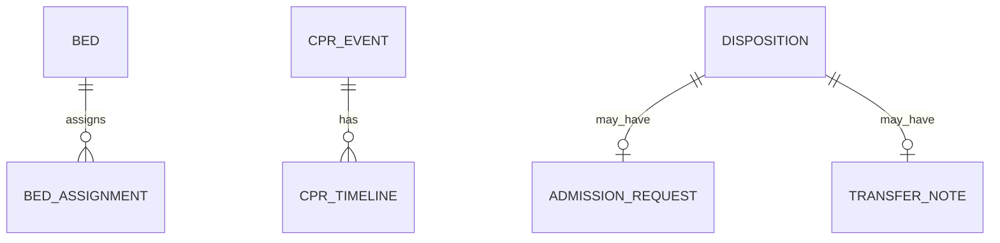

# 도메인 모델

근거: `ER_HIS_dbdiagram_oracle_1.dbml`, `ER_EMG_domain_code_oracle.dbml`, `개발표준가이드` 14장, `학습방식_변경_및_MSA_최소구현기준`(2026-07-22)  
DBMS: **Oracle** · 스키마: emergency-service 소유

## 1. 도메인 맵

```text
┌─────────────┐   reception_id(논리참조)   ┌──────────────┐
│ Reception   │◄──────────────────────────│   EMG BC     │
│ (RCP)       │                           │              │
└─────────────┘                           │  Triage      │
                                          │  Resource    │
┌─────────────┐   order_id(논리참조)       │  Care        │
│ GR2 Order   │◄──────────────────────────│  Channel     │
│ Core        │                           │  Monitor     │
└─────────────┘                           │  Disposition │
                                          │  Codes       │
┌─────────────┐   result/status 캐시       └──────────────┘
│ LAB / PHM   │◄── REF 테이블만
└─────────────┘
```

> `reception_id`, `order_id`, `*_by_id` 는 **물리 FK가 아닌 서비스 간 논리적 참조**입니다.

## 2. 엔티티 관계 개요


```mermaid
erDiagram
  BED ||--o{ BED_ASSIGNMENT : assigns
  CPR_EVENT ||--o{ CPR_TIMELINE : has
  DISPOSITION ||--o| ADMISSION_REQUEST : may_have
  DISPOSITION ||--o| TRANSFER_NOTE : may_have
```

모든 업무 행은 `reception_id`(또는 API의 encounterId)로 응급 방문에 묶입니다.

## 3. 테이블 상세

### 3.1 상태평가

| 테이블 | 주요 컬럼 | 유스케이스 |
| --- | --- | --- |
| `EMS_REFERRAL` | ems_agency_name, vitals_on_scene, prehospital_treatment, transmitted_at | EMS 조회 |
| `TRIAGE_ASSESSMENT` | ktas_level_code, assessment_type_code, assessed_by_id, assessed_at, reason | KTAS 분류/재평가 |
| `EWS_RECORD` | systolic_bp, heart_rate, resp_rate, temperature, spo2, gcs, ews_score | 조기 상태평가 |
| `ISOLATION_ASSESSMENT` | isolation_type_code, required_yn, decided_at, released_at | 격리 |
| `RISK_SCREENING` | screening_type_code(SEPSIS/STROKE), score, result_code | 위험 스크리닝 |

### 3.2 자원관리

| 테이블 | 주요 컬럼 | 비고 |
| --- | --- | --- |
| `BED` | bed_no, zone_code, bed_type_code, bed_status_code | 마스터 |
| `BED_ASSIGNMENT` | bed_id, assigned_at, released_at | 배정 이력 |

혼잡도는 `BED` 구역·상태 집계(`IX_BED_ZONE_STATUS` 인덱스)로 산출합니다. 의료기기(`EQUIPMENT*`)는 범위 제외.

### 3.3 응급진료

| 테이블 | 주요 컬럼 | 비고 |
| --- | --- | --- |
| `CLINICAL_NOTE` | content, recorded_by_id, recorded_at, signed_at | EMR |
| `TREATMENT_RECORD` | order_id(GR2), treatment_type_code, description, performed_at | 처치 |
| `MEDICATION_ADMINISTRATION` | order_id(**필수 정책**), order_item_id, drug_code, dose, route_code, administered_at | MAR |
| `CPR_EVENT` | started_at, ended_at, outcome_code | CPR 부모 |
| `CPR_TIMELINE` | cpr_event_id, event_at, event_type_code, detail | 타임라인 |
| `CONSENT_RECORD` | reception_id, consent_type_code, consent_status_code, consented_by_code, consenter_name, reason, received_at, recorded_by_id | 동의 기록(이력, 종이 동의서 수령 사실만) |

### 3.4 채널·참조 (처방 원장 아님)

| 테이블 | 역할 |
| --- | --- | --- |
| `LAB_IMAGING_RESULT_REF` | LAB 결과 링크/상태 캐시 (`result_ref`). 본문 SoT=LAB |
| `PHARMACY_STATUS_REF` | 조제 상태 캐시. 라우팅 SoT=GR2→PHM |
| ~~`CONSULT_REQUEST`~~ / ~~`SURGERY_ORDER_STATUS_REF`~~ / ~~`ONCALL_REQUEST`~~ | 협진·수술 요청·당직 — 범위 제외(코드 삭제, DB 테이블은 마무리 시점에 삭제 예정) |

**이관·제거됨 (GR2 소유):** `CLINICAL_ORDER`, `VERBAL_ORDER_CONFIRM`, `ORDER_CHANGE_LOG`, `MEDICATION_ORDER`

### 3.5 모니터링·퇴실

| 테이블 | 주요 컬럼 |
| --- | --- |
| `LOS_ALERT` | threshold_minutes, triggered_at, acknowledged_* |
| `DISPOSITION` | disposition_type_code, decided_by_id, decided_at |
| `ADMISSION_REQUEST` | disposition_id, target_dept_code, request_status_code |
| `TRANSFER_NOTE` | target_hospital_code, content, written_* |

### 3.6 업무코드

응급 전용 업무코드 테이블(`EMG_CODE_GROUP`, `EMG_CODE`)은 범위에서 제외했다(2026-09-30). 코드는 admin 공통코드가 소유하며, 서비스는 admin 캐시를 우선 쓰고 없을 때만 코드 안 폴백 상수를 쓴다.

## 4. EMG 소유 코드그룹 (시드)

| group_code | 예시 값 |
| --- | --- |
| CARE_STATUS | WAITING, IN_CARE, OBSERVATION, DISCHARGE_WAIT |
| ZONE | RESUS, CRITICAL, URGENT, FAST_TRACK, PEDIATRIC, ISOLATION |
| BED_TYPE | GENERAL, ICU_LIKE, ISOLATION, PEDIATRIC |
| BED_STATUS | EMPTY, OCCUPIED, CLEANING, OUT_OF_SERVICE |
| ASSESSMENT_TYPE | INITIAL, REASSESS |
| ISOLATION_TYPE | CONTACT, DROPLET, AIRBORNE, PROTECTIVE |
| SCREENING_TYPE / RESULT | SEPSIS, STROKE / NEGATIVE, POSITIVE, INCONCLUSIVE |
| ARRIVAL_PATH | EMS_119, WALK_IN, TRANSFER_IN, SELF_TRANSPORT |
| TREATMENT_TYPE | AIRWAY, IV, SUTURE, CAST… |
| CPR_EVENT_TYPE / CPR_OUTCOME | COMPRESSION, DEFIB… / ROSC, EXPIRED, TRANSFER |
| DISPOSITION_TYPE | HOME, ADMIT, TRANSFER, DEATH, DAMA |
| CONSENT_TYPE | SURGERY, ANESTHESIA, TRANSFUSION, PROCEDURE, PRIVACY |
| CONSENT_STATUS | AGREED, REFUSED, DEFERRED |
| CONSENT_BY | SELF, GUARDIAN |

**EMG 시드 금지 (타 소유)**

| 소유 | 코드 |
| --- | --- |
| ADM 공통 | KTAS_LEVEL, DEPT, DRUG, EXAM, DIAGNOSIS(KCD) |
| GR2 | ORDER_TYPE, ORDER_STATUS, PRIORITY, CHANGE_TYPE, VERBAL 상태 |

## 5. 식별자·네이밍 규칙

| 규칙 | 예시 |
| --- | --- |
| 테이블 | `UPPER_SNAKE_CASE` |
| 컬럼 | `lower_snake_case` |
| PK | `{table}_id` **VARCHAR2(36) UUID** (MSA 공통 통일) |
| 내부 FK | `{참조테이블}_id` VARCHAR2(36) — 동일 스키마 내 PK 참조 |
| 타 서비스 논리 참조 | 상대 SoT 타입 따름 (`reception_id`, GR2 `order_id` 등) |
| 업무번호(순수) | `*_no` VARCHAR2(20) — 타 서비스 PK 참조가 아닌 경우만 |
| `reception_id` | **VARCHAR2(36)** — RCP `RECEPTION_ID`(PK)를 참조하는 논리 FK. 이전에는 `reception_no`로 불렀으나, RCP 실제 PK 컬럼명과 일치시켜 혼동을 없애기 위해 `reception_id`로 통일(2026-09-03). PK/FK VARCHAR2(36) 통일 합의(2026-08-26)는 그대로 유지 |
| 코드 | `*_code` / `*_cd` |
| 여부 | `*_yn` CHAR(1) |
| 일시 | `*_at` TIMESTAMP |
| API JSON | camelCase (`triageAssessmentId`) |

## 6. 범위 외

- **동의서 원본·서명**: 저장하지 않는다. 종이 동의서를 받은 사실만 `CONSENT_RECORD`에 기록(UD2-25).
- **범위 제외 테이블**(2026-09-30): `CONSULT_REQUEST`, `ONCALL_REQUEST`, `SURGERY_ORDER_STATUS_REF`, `AMBULANCE_TRANSPORT`, `EQUIPMENT`, `EQUIPMENT_ALLOCATION`, `EMG_CODE_GROUP`, `EMG_CODE`.
- 환자명·처방의명 등: 스냅샷 금지 → PAT/ADM API 조회.
